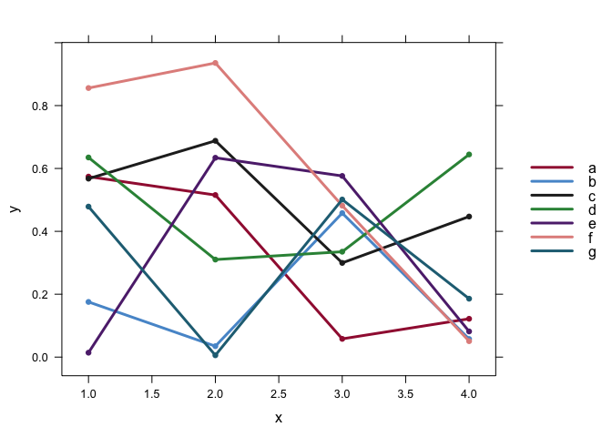
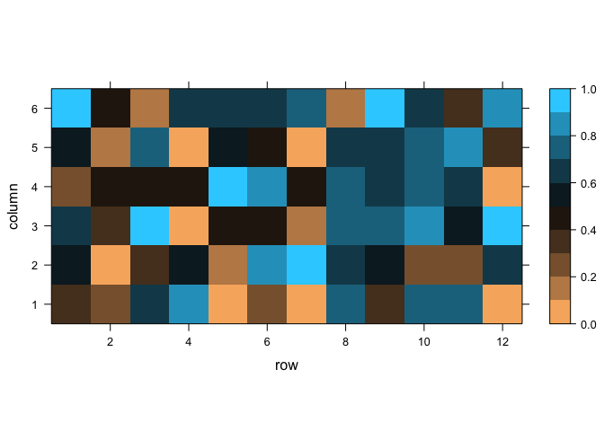
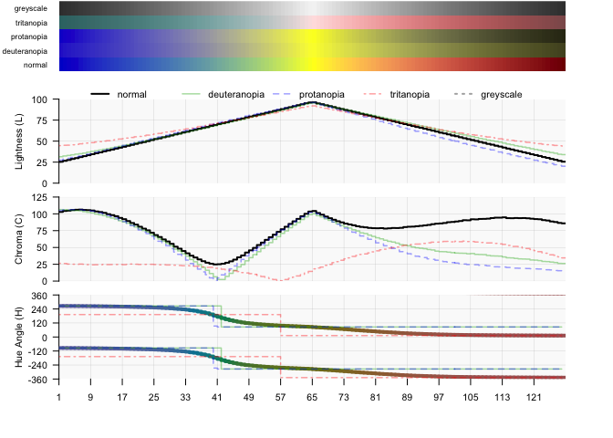

<!-- README.md is generated from README.Rmd. Please edit that file -->

# datacolor

Color for Data Visualization

This package provides

  - prebuilt color palettes appropriate for data representation,  
  - functions for defining color palettes for data representation,
  - utilities for analysis of palettes as perceived by normal and
    colorblind viewers.

Color palettes for data should ideally be perceptually linear in all
perceptual color dimensions (hue, chroma or saturation, lightness or
luminance). Ideally, palettes should aslo be color-blind safe (i.e. they
should preserve an appropriate mapping of data to perceived color for
colorblind viewers). Palettes may also need to be black and white
printer-friendly, if there is a chance plots will be printed in
greyscale. Additional requirements for color scales can include the
presence or absence of discontinuities and corners, maximizing
discrimination between levels, and respecting semantic relationships
between colors.

This package relies on the perceptually flat colorspace HCL, which
represents color as preceived by people with normal vision. HCL
functions from the `grDevices` and `colorspace` packages. This package
also relies on the `dichromat` R package to simulate color perception
under the three most common forms of colorblindness.

## Installation

Install the `datacolor` package from github:

``` r
# install.packages("devtools")
# devtools::install_github("allopole/datacolor")
```

## Analysis and display of palettes

See `?colorbar` for description of `colorbar` and `colorplot` functions

``` r
library(datacolor)

# colorbar
pal <- grDevices::rainbow(36)
colorbar(pal)
```

<!-- -->

``` r
colorbar(pal,dots=TRUE)
```

<!-- -->

``` r
colorbar(pal,colorblind=TRUE)
```

<!-- -->

``` r
colorbar(pal,dots=TRUE,colorblind=TRUE)
```

<!-- -->

``` r
# colorplot
colorplot(pal)
```

<!-- -->

``` r
colorplot(pal,dots=TRUE)
```

<!-- -->

``` r
colorplot(pal,colorblind=TRUE)
```

<!-- -->

``` r
colorplot(pal,dots=TRUE,colorblind=TRUE)
```

<!-- -->

## Converters

### Hex RGB(A) to HCL

See `?hex2hcl`

``` r
pal <- grDevices::rainbow(7)
hex2hcl(pal)
#>          L         C         H
#> 1 53.24059 179.04076  12.17395
#> 2 87.93359  99.06045  70.80684
#> 3 88.41572 131.42191 125.28214
#> 4 88.72855 101.91099 140.44048
#> 5 59.68357 107.18352 251.07185
#> 6 35.26953 133.01102 268.61838
#> 7 58.39541 128.42964 320.66953
```

### Hex RGB palette to simulated colorblind hex RGB

See `?colorblind`

``` r
pal <- grDevices::rainbow(7)
colorblind(pal)
#> $normal
#> [1] "#FF0000FF" "#FFDB00FF" "#49FF00FF" "#00FF92FF" "#0092FFFF" "#4900FFFF"
#> [7] "#FF00DBFF"
#> 
#> $deuteranopia
#> [1] "#949405" "#E4E426" "#DBDB3C" "#D9D997" "#7E7EFD" "#3B3BFC" "#9494D7"
#> 
#> $protanopia
#> [1] "#60601C" "#DFDF17" "#F2F206" "#F1F191" "#8989FE" "#2121FF" "#6060DB"
#> 
#> $tritanopia
#> [1] "#F35B5B" "#FBC9C9" "#8AE5E5" "#74E9E9" "#33AAAA" "#3F7F7F" "#E97676"
#> 
#> $greyscale
#> [1] "#7F7F7FFF" "#DCDCDCFF" "#DEDEDEFF" "#DFDFDFFF" "#909090FF" "#535353FF"
#> [7] "#8C8C8CFF"
colorplot(colorblind(pal)$deuteranopia)
```

<!-- -->

## Precalculated palettes

### 7-category qualitative palette for nominal data

See `?unipalette` for details

  - designed for high contrast against a white background, with good
    distinction among colors
  - colors distinguishable under two most common forms of colorblindness
  - colors distinguishable in greyscale for b/w printing
  - Good for bar charts, box plots, pies, etc.
  - Line should be relatively thick
  - Points should be relatively large

<!-- end list -->

``` r
colorplot(unipalette(),colorblind = TRUE)

## Sample plot
randomseries <- data.frame(x=1:4, y=runif(4*7), grp=rep(letters[1:7],each=4))
pal <- unipalette()
lattice::xyplot(y~x, group=grp, data=randomseries, type="b", pch=16, lwd=3, col = pal,
      key = list(space = "right", lines = list(col=pal, lwd=3), text=list(letters[1:7]))
      )
```

<!-- --><!-- -->

### A Sequential palette for heatmaps

A replacement for `grDevices::heat.colors()` or `colorspace::heat_hcl()`

See `?heat` for details

Palette characteristics:

  - perceptually linear
  - color-blind-safe (under three most common forms of colorblindness)
    and print friendly
  - under normal vision: linear lightness, chroma, and hue gradients
  - under colorblind viewing, linear lightness, smooth chroma, flat hue
    gradients
  - appropriate for display of temperature, intensity, etc.

<!-- end list -->

``` r
colorplot(datacolor::heat(128),colorblind = T)
mtext("datacolor::heat()", side=1, line = 2.5)
```

<!-- -->

#### Comparison of Heat Palettes

``` r
n <- 128

colorplot(grDevices::heat.colors(n), colorblind = TRUE)
mtext("grDevices::heat.colors(128)", side=1, line = 2.5)
```

<!-- -->

``` r

colorplot(viridis::inferno(128), colorblind = TRUE)
mtext("viridis::inferno(128)", side=1, line = 2.5)
```

<!-- -->

``` r

colorplot(colorspace::heat_hcl(n), colorblind = TRUE)
mtext("colorspace::heat_hcl()", side=1, line = 2.5)
```

<!-- -->

``` r

colorplot(datacolor::heat(128),colorblind = T)
mtext("datacolor::heat()", side=1, line = 2.5)
```

<!-- -->

``` r

## Maroon to yellow through salmon and pink
stops <- c('#800000', '#CD4949', '#FF9696','#FFFF00')
palette <- multiHue(128,colors=stops)
colorplot(palette,colorblind = TRUE) # display palette
mtext("datacolor::multiHue(128,c('#800000', '#CD4949', '#FF9696','#FFFF00'))", side=1, line = 2.5)
```

<!-- -->

### A divergent colorscale for AUC (Area Under the Curve) heatmaps

See `?AUColors` for details

Palette characteristics:

  - color-blind-safe (under three most common forms of colorblindness)  
  - perceptually linear  
  - equal brightness gradients on both sides of central value  
  - constant hue and chroma on either side of central value  
  - Dark value for no correlation (near 0.5); bright values for high
    correlation (near 1 and 0)  
  - Blue for positive correlation (1); orange for negative correlation
    (0)  
  - NOT suitable for b/w printing, as low and high values are not
    distinguishable in greyscale (however, greyscale printing still
    accurately shows the absolute distance from 0.5)

<!-- end list -->

``` r
## default palette (n = 10):
p <- AUColors()
colorplot(p,colorblind = TRUE)
```

<!-- -->

``` r

## inverted and reversed, with grey center bin:
p <- AUColors(n=21,invert=TRUE,reverse=TRUE)
colorplot(p,colorblind = TRUE)
```

<!-- -->

``` r

# Sample AUC Heat Map
randommatrix <- matrix(runif(12*6),ncol=6)
nlevels <- 10 
lattice::levelplot(randommatrix,
  at = seq(0,1,1/nlevels), # number of breaks
  col.regions = AUColors(nlevels), # color map
  aspect = "iso")
```

<!-- -->

## HCL Palettes with power curves, stepped and cyclic elements

Use `rampx()`, `stepx()`, and `cyclx()` to construct numeric vectors of
`H`, `C`, and `L`.

See `?cyclx` for description of `rampx()`, `stepx()`, and `cyclx()`.

Use `hcl2hex()` to convert HCL palette to a hex RGB palette.

Depricated: `cyclic_hcl`

``` r
library(datacolor)

n <- 36

pal <- hcl2hex(
  H=rampx(from=260,to=-100,n=n),
  C=stepx(from=40,to=60,n=n,step.n=n/3),
  L=100*cyclx(from=.75,to=.45,n=n,
              step.n=n/3,exponent=1,
              cyc.from=.8,cyc.to=1,cyc.n=n/3,cyc.exponent=2.5)
  )

colorplot(pal)
```

<!-- -->

## Multihue HCL Palettes (with bezier interpolation and lightness correction)

`multihue()`, `multihue.diverge()` and `multihue.constantL()` create
multi-hue (multi “stop”) color scales with perceptually linear lightness
gradients and smooth hue gradients (with no first or second order
discontinuities).

The palettes follow bezier curves through HCL space. The bezier curves
are defined by two endpoint colors and one or more optional intermediate
color “stops.” The intermediate stops are treated as control points for
the bezier curve, and are therefore not necessarily present in the final
palette.

After interpolation, the palettes are stretched to counter any
non-linearity in lightness gradient arising from the presence of
intermediate color stops. The resulting palette has a perceptually
linear lightness gradient.

`multihue.diverge()` builds a divergent palette by concatenating two
bezier curves (defined by a “left” and “right” set of color stops).

See `?multiHue` for description of `multiHue()`, `multiHue.diverge()`
and `multiHue.constantL()`

For a discussion of bezier interpolation in HCL with lightness
correction, see:

Gregor Aisch. *Mastering Multi-hued Color Scales with Chroma.js.* Blog
post. Sep 9, 2013
<https://www.vis4.net/blog/2013/09/mastering-multi-hued-color-scales/>

Palette characteristics:

  - perceptually linear lightness gradients (or constant lightness for
    `multihue.constantL()` )
  - smooth hue and chroma gradient throughout (no “corners”)
  - multiple color stops allow increased color discrimination between
    levels
  - hue and chroma gradients not necessarily linear. Only brightness is
    adjusted for linearity.
  - `multihue()`, `multihue.diverge()` produce print-friendly palettes.
  - `multihue.diverge()` may produce a palette with a central
    discontinuity (first or second order)

<!-- end list -->

``` r
## default = blue to yellow through green, 11 colors
p <- multiHue()
colorplot(p,colorblind=TRUE)
```

<!-- -->

``` r
colorplot(p)
```

<!-- -->

``` r

## Maroon to yellow through salmon and pink
stops <- c('#800000', '#CD4949', '#FF9696','#FFFF00')
palette <- multiHue(128,colors=stops)
colorplot(palette, colorblind=TRUE) # display palette
```

<!-- -->

``` r

## Divergent (default)
p <- multiHue.diverge(128)
colorplot(p,colorblind=TRUE)
```

<!-- -->

``` r

## Divergent with discontinuity: left = Blue to Cyan, right = Yellow to Red
leftstops <- c("#3136AA","#3980B0","#00C5C0","#8EFDFD")
rightstops <- c("#F3F300","#FF8CB4","#CD4C4C","#8F0000")
palette <- multiHue.diverge(128,leftstops,rightstops,continuous=FALSE)
colorplot(palette,colorblind=TRUE)
```

<!-- -->

``` r

## Constant Lightness (and chroma) color palette:
## 4 color stops define the bezier curve through HCL space; n=6 colors are output.
palette <- multiHue.constantL(n=64, h=c(-180, -105, -45, 0),c=50,l=60)
colorplot(palette,colorblind=TRUE)
```

<!-- -->

### Comparison with non-bezier multi-hue palettes

By comparison, here is the “rainbow” palette showing discontinuities
typical of multi-hule palettes. This palette includes corners (second
order discontinuities) in lightness. From a perceptual point of view,
this palette is not a continuous colors scale, but a multiply-diverging
scale with three distinct articulation points (at 1/6, 1/2 and 5/6 of
the palette length).

``` r
pal <- grDevices::rainbow(128)
colorplot(pal,colorblind=TRUE)
```

<!-- -->
